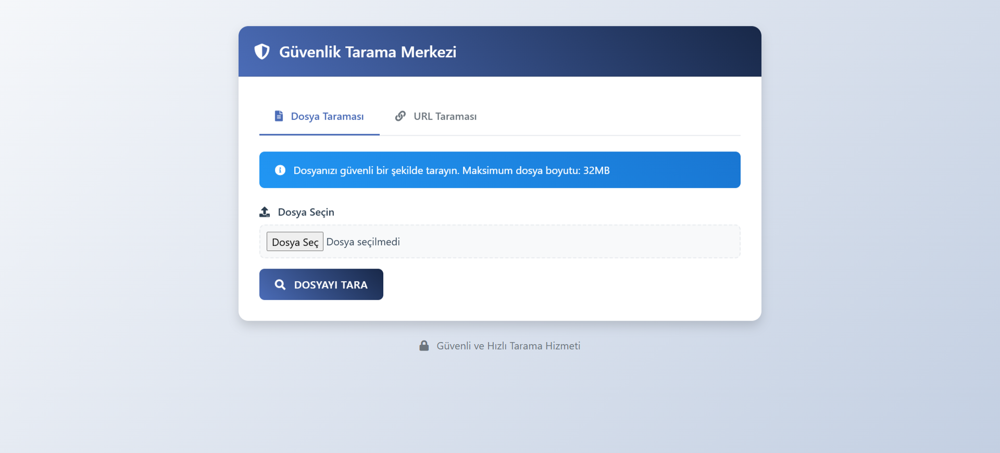
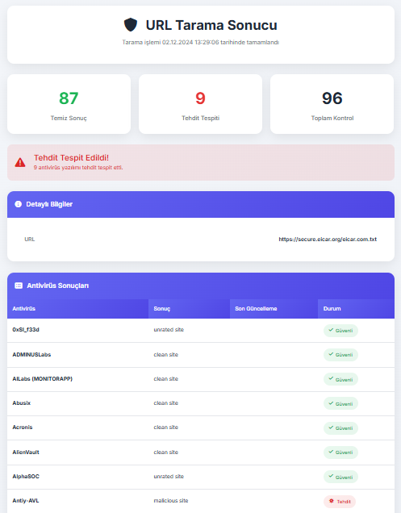

# 🛡️ Güvenlik Tarama Merkezi

<div align="center">


</div>

## 📋 Proje Hakkında

Bu proje, VirusTotal API kullanarak dosya ve URL'lerin güvenlik taramasını yapan bir web uygulamasıdır. Kullanıcılar dosyalarını veya şüpheli URL'leri güvenli bir şekilde tarayabilir ve detaylı güvenlik raporlarını görüntüleyebilir.

### 🛠️ Kullanılan Teknolojiler

- Backend: Node.js, Express.js
- Frontend: HTML, CSS, JavaScript
- API: VirusTotal API
- Template Engine: EJS
- Diğer: Multer (dosya yükleme)

## ✨ Özellikler

- 📁 Dosya tarama (32MB'a kadar)
- 🔗 URL tarama
- 📊 Detaylı tarama sonuçları
- 🔄 Gerçek zamanlı sonuç takibi
- 📱 Responsive tasarım
- 🎨 Modern ve kullanıcı dostu arayüz

## 🚀 Kurulum

1. **Depoyu Klonlayın:**
   ```bash
   git clone https://github.com/kullaniciadi/projeadi.git
   cd projeadi
   ```

2. **Bağımlılıkları Yükleyin:**
   ```bash
   npm install
   ```

3. **Çevresel Değişkenleri Ayarlayın:**
   ```bash
   cp .env.example .env
   # .env dosyasında VT_API_KEY'i ayarlayın
   ```

4. **Uygulamayı Başlatın:**
   ```bash
   npm start
   ```

## 📱 Ekran Görüntüleri

<div align="center">

### 🏠 Ana Sayfa


### 📊 Sonuç Ekranı


</div>

## 📝 Lisans

Bu proje MIT lisansı altında lisanslanmıştır. Detaylı bilgi için [LICENSE](LICENSE) dosyasına bakınız.

---

<div align="center">

### ⭐️ Bu projeyi beğendiyseniz yıldız vermeyi unutmayın!

</div>